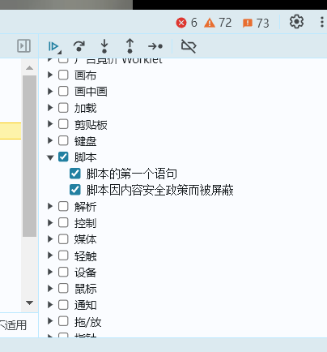
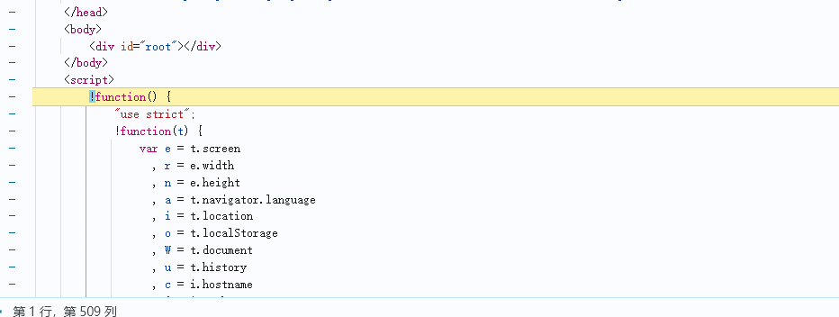
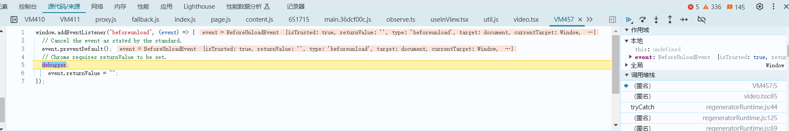
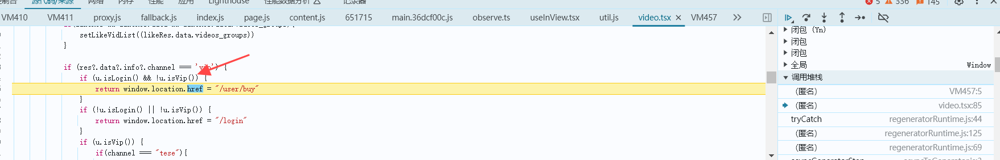
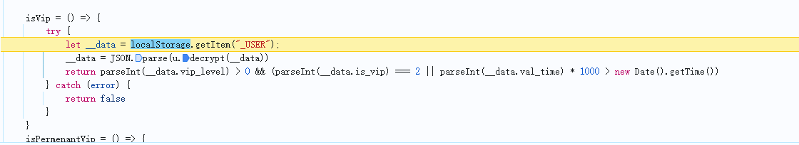
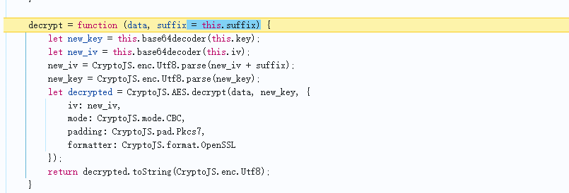
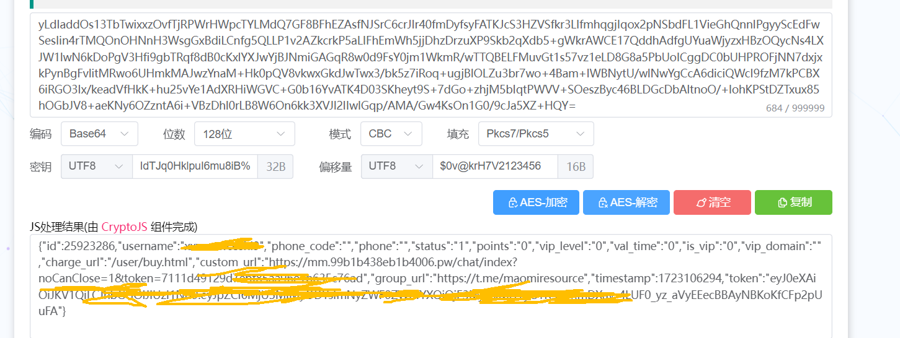

# 分析网站
1.今天来逆向一个朋友给的网站，域名为aHR0cHM6Ly9jZmQ0NjJjNWIwOTIuY29tL21haW4=，朋友提出了一个问题，想看vip，但是
兜里很空，怎么办，而且不想要太麻烦。
为了满足我们的好朋友。
来呗，逆向搞一下，随便点击一个vip视频，发现进入了一个登陆页面，这里发现注册不需要手机号，直接随便注册一个账号登录，

2.回到域名下的main页面，随意打开一个vip视频，发现域名变成.../s/video/shipin/...类似的格式，但是没到一会就变成了
user/buy的界面下告知你要购买vip。
我们可以大胆地猜测它是用什么方式检测的vip，1.用用户传递的cookie后台检测，这种就没办法了。2将用户的配置发送给前端
进行检测。不论哪种情况，我们都需要首先检测到它跳转页面的点在哪，也许就是检测关键
## 分析页面跳转
1.首先遇到页面跳转暂时有俩种情况，第一种情况下是新开一个页面，在以前做过的网页中遇到过这种情况，这种情况下，调用了window.open方法，我们可以hook此方法。第二种情况就是刷新页面，修改当前页面href值，或者进行其他修改。

2很显然，在此地方，这种页面属于第二种情况，我们凭借手速，复制跳转一瞬间的页面域名也就是.../s/video/shipin/..这种格式当然你也可以使用fiddler抓包这样好复制，但为了图方便，这里就不使用fiddler了。
打开一个空白页面，并且打开控制台中的事件监听器的脚本控制断点选项

        
然后在域名中粘贴回车，断点到html页面

在这里停住，**注意，上述第一种方法我们说了hookopen，这里是第二种方式的hook，在浏览器中有beforeunload事件**。当浏览器窗口关闭或者刷新时，会触发 beforeunload 事件。当前页面不会直接关闭，可以点击确定按钮关闭或刷新，也可以取消关闭或刷新。
我们现在就要hook这个，在mdn中可以搜到相关介绍
***
`window.addEventListener("beforeunload", (event) => {
  event.preventDefault();
  debugger;
    event.returnValue = "";
});`
***
我们直接在代码中添加debugger，当然也有第二种写法， 这里猜想应该是每个版本迭代之后语法更新了，所以变化了
***
`window.onbeforeunload=function(){debugger};`
***
这里是网上得到的介绍
***
onbeforeunload 事件在即将离开当前页面（刷新或关闭）时触发。
该事件可用于弹出对话框，提示用户是继续浏览页面还是离开当前页面。
对话框默认的提示信息根据不同的浏览器有所不同，标准的信息类似 "确定要离开此页吗？"。该信息不能删除。
但你可以自定义一些消息提示与标准信息一起显示在对话框。
注意： 如果你没有在 <body> 元素上指定 onbeforeunload 事件，则需要在 window 对象上添加事件，并使用 returnValue 属性创建
***
我们继续，断住了之后，跟堆栈，往上跟一个就找到的检测vip的函数，回到了我们的猜想，应该是在本地进行检测

很明显，我们在isvip打断点，重新刷新网页
跟进isvip函数里面，发现是这样的

因为没有混淆加密，我们可以很直观的看见它是判断了__data.vip_level和__data.is_vip字符串，那我们需要修改的就很少了
直接把__data的这俩个字符串分别赋值为1和2，然后经历几次同样的操作，我们发现页面正常显示。这一段逆向也就结束了

但是，我的朋友不想每次都自己这样操作，他要快捷。我怎么能不满足他的愿望呢。

### 油猴脚本扩展

1从之前的图，我们很容易发现，他的数据是从localStorage得到的，使用了getItem方法，那我们自己实现数据加密，并且修改
localStorage的值为我们修改后的值，并且让它不能修改，在页面之前执行，岂不是完美，这要用到我们的油猴脚本了，
因为我并不想做太多复杂操作，所以来最简单的方式。我们看看它AES解密是怎么解的
***
,
***
，一步一步跟下去，很容易得到他的偏移量和他的密钥还有模式，我们直接找个在线网站试一下。AES的相关原理b站视频介绍有很多
***

***
哈哈，完成，把解密的俩个参数修改一下，又加密回去，我们就可以在getitem方法重写，如果他想得到"_USER"字段，就返回我们的加密的值

***

接下来就是写插件
`(function() {
    'use strict';
    var _getitem = Storage.prototype.getItem;
    Storage.prototype.getItem = function () {
    if('_USER'==arguments[0]){
        return '你的加密文本'
    };
    return _getitem.apply(this,arguments)
};
    // Your code here...
})();`
写的不是太严谨，至于js的原型链知识就不过多叙述，网上有很多相关知识了
，在配置下域名相关的东西。完美

**我的朋友感动哭了。**
**注意以上知识仅供学习交流**
